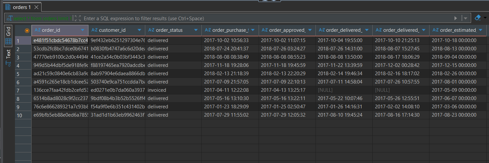
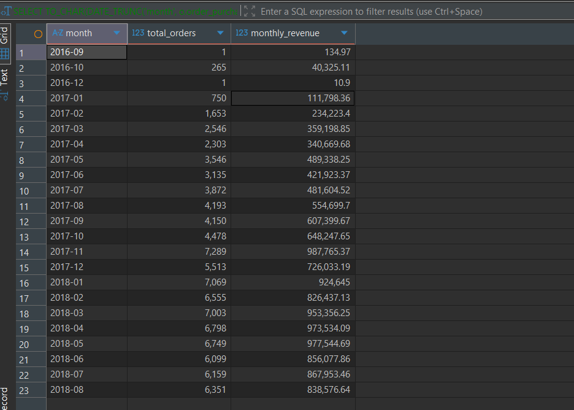
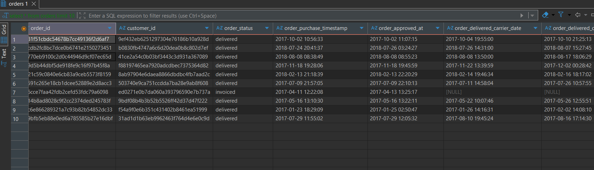
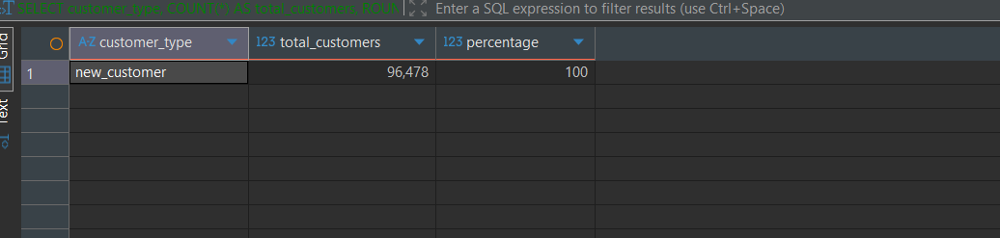
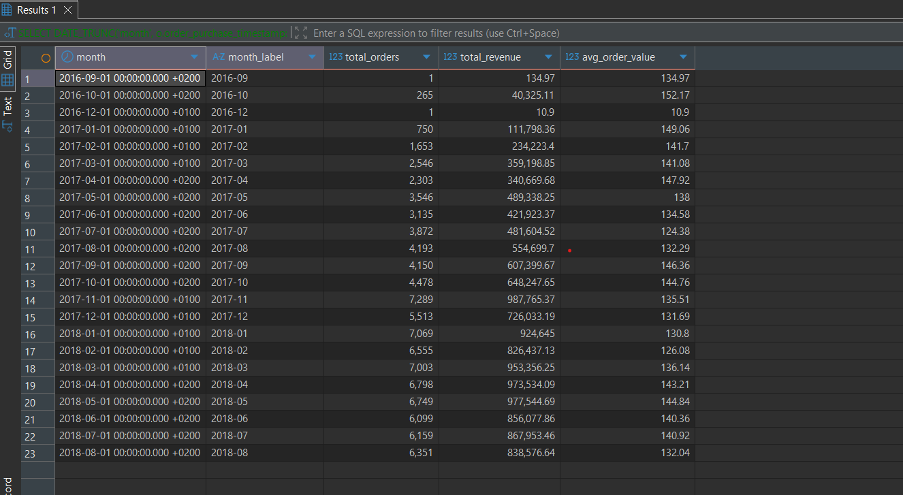
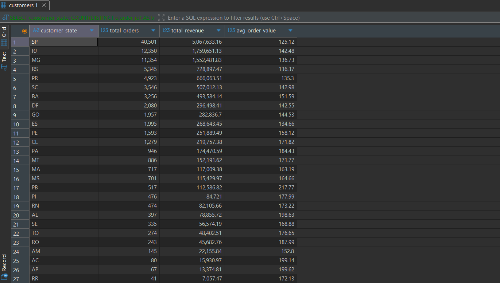

# E-Commerce SQL Business Analysis

## Project Overview
End-to-end SQL business analysis of a Brazilian e-commerce platform (Olist), 
exploring customer behaviour, revenue trends, and geographic sales distribution 
using PostgreSQL. This project demonstrates core data analyst skills including 
SQL querying, data modelling, and business insight generation.

## Business Questions Answered
- Which product categories generate the most revenue?
- How has monthly revenue trended over time?
- What is the customer lifetime value distribution?
- What percentage of customers are repeat buyers?
- What is the average order value per month?
- Which states and cities drive the most sales?

## Key Insights
- **Beauty & Health** is the top revenue category with R$1.26M across 9,670 orders
- **Monthly revenue grew consistently** from 2016 to late 2018, with a notable spike around November 2017 (Black Friday)
- **96,478 customers (≈100%)** made only one purchase — indicating a critical retention problem for the platform
- **Average Order Value** remained stable at R$135–144, suggesting consistent purchasing behaviour
- **São Paulo state alone** dominates sales, reflecting Brazil's economic concentration in the Southeast

## Dataset
- Source: [Olist Brazilian E-Commerce Dataset](https://www.kaggle.com/datasets/olistbr/brazilian-ecommerce)
- 7 tables: orders, customers, products, order_items, payments, sellers, reviews
- ~100,000 orders from 2016–2018

## Tech Stack
- PostgreSQL — database
- DBeaver — SQL client
- Python (Pandas, SQLAlchemy) — data loading
- Jupyter Notebook — data pipeline

## Database Schema
| Table | Key Columns |
|---|---|
| orders | order_id, customer_id, order_status, timestamps |
| customers | customer_id, customer_city, customer_state |
| order_items | order_id, product_id, seller_id, price |
| products | product_id, product_category_name |
| payments | order_id, payment_value |
| sellers | seller_id, seller_city, seller_state |
| reviews | order_id, review_score |

## Query Results

### Top Revenue Products

### Monthly Revenue Trend

### Customer Lifetime Value

### Repeat vs New Customers

### Average Order Value

### Geographic Distribution

## How to Run
1. Install PostgreSQL and DBeaver
2. Download the dataset from Kaggle (link above)
3. Run `notebooks/data_loading.ipynb` to load data into PostgreSQL
4. Open any query from the `queries/` folder in DBeaver and execute

## Author
**Tonin Thomas** — MSc Data Science, University of Europe for Applied Sciences  
[LinkedIn](https://www.linkedin.com/in/toninthomas-98a48219a/) | 
[GitHub](https://github.com/doofrshmirtz)
