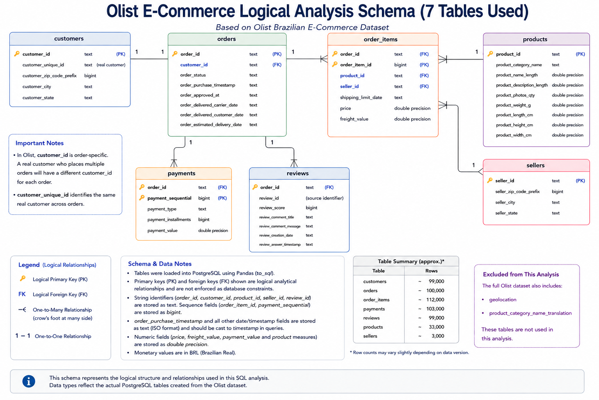
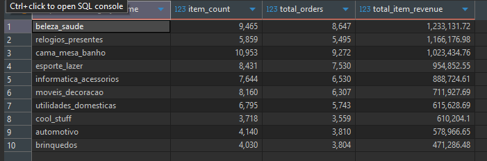
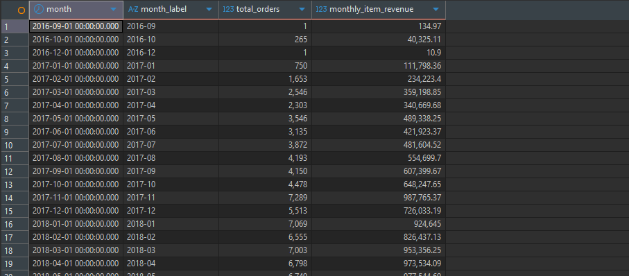
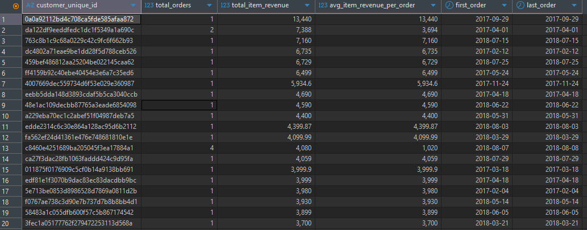
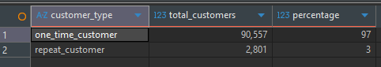
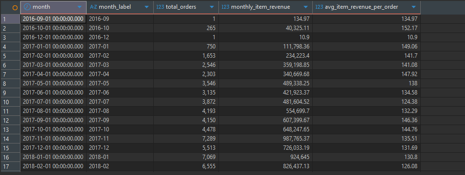
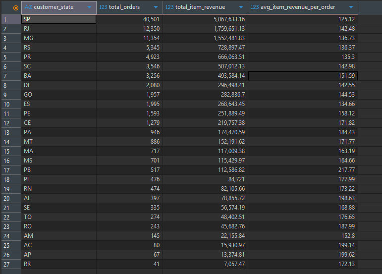

# E-Commerce SQL Business Analysis

## Executive Summary

This project analyses approximately 100,000 orders from the Brazilian
Olist e-commerce marketplace using PostgreSQL.

The analysis focuses on revenue performance, customer retention,
customer value, average order value and geographic sales distribution.

## Business Objectives

- Identify the highest-revenue product categories
- Analyse monthly revenue development
- Measure customer lifetime value
- Calculate repeat-customer behaviour
- Track average order value
- Identify high-performing states and cities

## Dataset

The project uses the Olist Brazilian E-Commerce Dataset.

Main tables:

- orders
- customers
- order_items
- products
- payments
- sellers
- reviews

## Tools

- PostgreSQL
- DBeaver
- Python
- Pandas
- SQLAlchemy
- Jupyter Notebook

## Database Structure



> **Schema note:** The tables were cleaned and loaded into PostgreSQL using
> Pandas. The primary-key and foreign-key relationships shown represent the
> logical analytical model and are not currently enforced as PostgreSQL
> constraints.

Relationship-validation queries are available in
[`schema/relationship_validation.sql`](schema/relationship_validation.sql).

## Analysis

### 1. Product Category Revenue

Business question:

Which product categories generate the highest revenue?

Key finding:

Beauty and Health generated approximately R$1.26 million in revenue
and was the highest-performing product category.



SQL file:

`queries/01_top_revenue_products.sql`

### 2. Monthly Revenue Trend

Business question:

How did delivered-order revenue change over time?

Key finding:

Revenue increased strongly during the observation period, with a
noticeable peak around November 2017.



SQL file:

`queries/02_monthly_revenue_trend.sql`

### 3. Customer Lifetime Value

Add your verified result here.



SQL file:

`queries/03_customer_lifetime_value.sql`

### 4. Customer Retention

The analysis found that the overwhelming majority of customers placed
only one order, indicating a major retention opportunity.



SQL file:

`queries/04_repeat_vs_new_customers.sql`

### 5. Average Order Value

Average order value remained relatively stable across the analysed
period.



SQL file:

`queries/05_average_order_value.sql`

### 6. Geographic Sales Distribution

São Paulo was the strongest geographic market by revenue and order
volume.



SQL file:

`queries/06_geographic_sales_distribution.sql`

## SQL Skills Demonstrated

- Multi-table joins
- Aggregations
- Conditional logic
- Subqueries and CTEs
- Date-based analysis
- Customer-level analysis
- KPI calculation
- Business insight generation

## Repository Structure

```text
Ecommerce-SQL-Business-Analysis/
├── notebooks/
│   └── data_loading.ipynb
├── queries/
│   ├── 01_top_revenue_products.sql
│   ├── 02_monthly_revenue_trend.sql
│   ├── 03_customer_lifetime_value.sql
│   ├── 04_repeat_vs_new_customers.sql
│   ├── 05_average_order_value.sql
│   └── 06_geographic_sales_distribution.sql
├── screenshots/
└── README.md
```

## How to Reproduce

1. Download the [Olist Brazilian E-Commerce Dataset](https://www.kaggle.com/datasets/olistbr/brazilian-ecommerce) from Kaggle.
2. Create a PostgreSQL database for the project.
3. Update the local database connection details in the data-loading notebook or configuration file.
4. Run `notebooks/data_loading.ipynb` to load the CSV files into PostgreSQL.
5. Execute the SQL files in numerical order:

   - `queries/01_top_revenue_products.sql`
   - `queries/02_monthly_revenue_trend.sql`
   - `queries/03_customer_lifetime_value.sql`
   - `queries/04_repeat_vs_new_customers.sql`
   - `queries/05_average_order_value.sql`
   - `queries/06_geographic_sales_distribution.sql`

## Limitations

- The dataset covers a historical period from 2016 to 2018.
- Customer identities are anonymised.
- The analysis does not include product cost or profit-margin data.
- Repeat-purchase analysis may be affected by the dataset's customer identifier structure.
- The findings are specific to the available Olist marketplace data and may not represent current e-commerce behaviour.
-  `review_id` is not globally unique in the imported source and may be reused across different orders. Review analyses therefore use `order_id` as the primary relationship to the orders table.

## Author

**Tonin Thomas**  
MSc Data Science Candidate  
Expected graduation: September 2026  

[GitHub Profile](https://github.com/doofrshmirtz)
